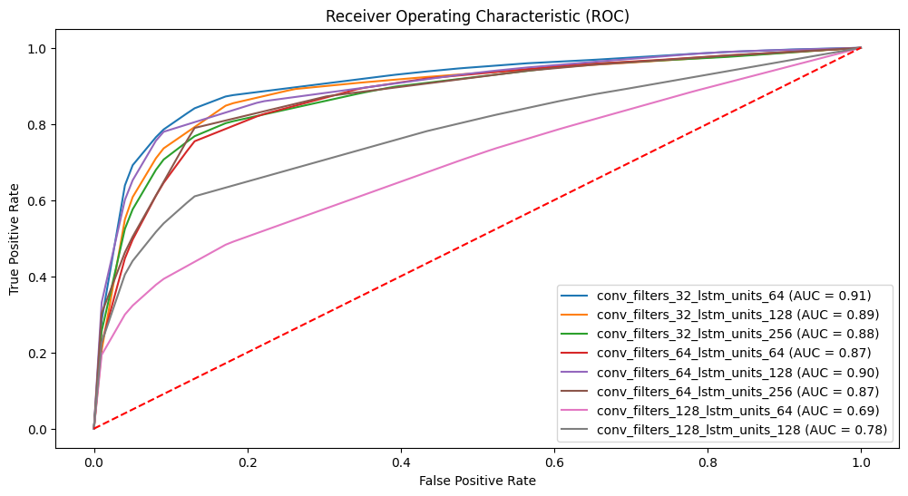
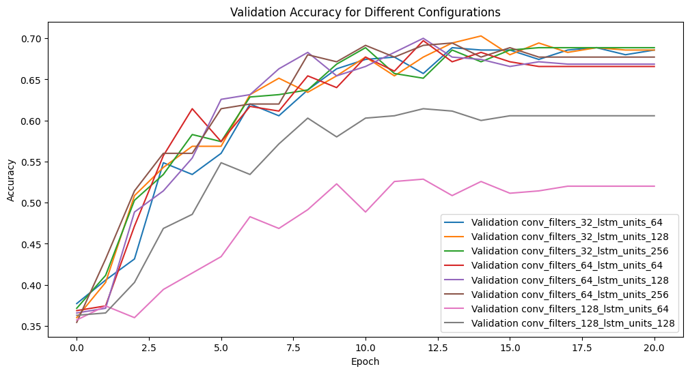
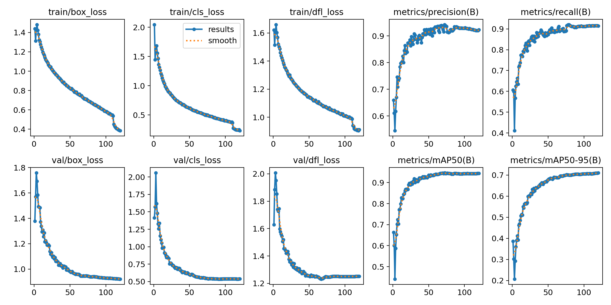

# YOLO-CNN-LSTM Model for Image Classification
## Requirements
To run the code in this repository, you need to have the following libraries installed:

- Python 3.x
- TensorFlow
- Keras
- NumPy
- Matplotlib
- OpenCV
- Jupyter

You can install the required packages using the following command:

```bash
pip install tensorflow keras numpy matplotlib opencv-python-headless jupyter
```
## 1. Project Objective and Content Overview
 
Title: Deep learning for violence and abuse detection in cinema and series: OTT streaming platforms
Content: This project uses deep learning and computer vision techniques to detect and remove violent and inappropriate content from movie videos. Unlike current common detection methods that only identify whether the violence is violent or not, the framework also categorizes the identified violence in terms of lowand high levels  in movies. It combines YOLO and CNN-LSTM models to detect and categorize violent content with 70% accuracy. With the increased concern about violent content in Hollywood movies, the framework fills the current gap in content review for streaming platforms, reducing the reliance on manual content review and improving efficiency. Its scalability across different video types makes it a powerful tool for content management on digital platforms.

## 2.Dataset, Preprocessing and Project Structure
### a) AIRTLab Dataset
Dataset AIRTLab: https://github.com/airtlab/A-Dataset-for-Automatic-Violence-Detection-in-Videos

### b) Roboflow Violence Detection Dataset
Roboflow Violence Detection Dataset: https://universe.roboflow.com/violence-detection-fbe46/violence-detection-nbx24

Around 10 thousand images anotated by 4 classes of box bounding, include NonViolence, Violence, guns, knife.

### c) Project logic

- First of all, we made a new organizing classification of the above dataset into nonviolent (including gesture, handshake, highfive, hug, jump, walk, and greet), low-violence (including push, slap, choking, stifle, kick, and punch), and high-violence (including shoot, stab, and club).
- Secondly, the classified video is extracted by drawing three frames per second and saving 1 frame every 10 frames, i.e., saving 0,10,20,... frames. For the yolo part, the shape of the frame is (640x640x3), and it needs to be labeled with labeling for action; for the CNNLSTM part, the shape of the frame is (64X64X3). Finally, the yolo part refers to: yolo.ipynb; CNNLSTM refers to: train_cnn_lstm.ipynb, test_cnn_lstm.ipynb. Jupyter Notebook containing the model training, testing and evaluation.

## 3. Experiment results
### 3dcnn-lstm training result



### Yolov8 training result


### Streaming videos analysis
#### Non-violence

#### Low-level violence


#### high-level violence

